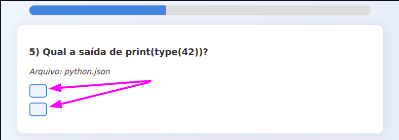

# 📘 Simulado Interativo

Bem-vindo ao **Simulado Interativo**, uma plataforma leve e moderna para realizar simulados diretamente no navegador, com visual bonito, som de acertos/erros e suporte a modo escuro. Desenvolvido com foco em estudantes, concurseiros e autodidatas que querem treinar seus conhecimentos de forma prática e organizada.

---

## 🎯 Objetivo

Criar uma experiência de simulado realista e interativa, utilizando arquivos `.json` contendo questões de múltipla escolha. Ideal para estudar com foco e simular provas com tempo e desempenho por questão.

---

## 👤 Público-alvo

- Estudantes em geral
- Concurseiros
- Preparatórios para provas
- Professores que queiram gerar simulados a partir de banco de questões

---

## ⚙️ Como funciona

O projeto é dividido em duas páginas principais:

- **Simulado Geral (`simulado_geral.html`)** – exibe todas as questões dos arquivos `.json` fornecidos.
- **Simulado Aleatório (`simulado_real.html`)** – seleciona 10 questões aleatórias de arquivos distintos com um cronômetro de 1 hora.

Além disso, você pode:

- Carregar pastas com arquivos `.json`
- Ver barra de progresso e tempo restante
- Receber feedback com som ao responder
- Alternar entre modo claro e escuro 🌙
- Salvar estatísticas e tempo por questão (em desenvolvimento)

---

## 📂 Como usar

1. Clone o repositório:
   ```bash
   git clone https://github.com/cleitonleonel/SimuladoInterativo.git -o simulado-interativo
   ```

# 📘 Guia para Criar Arquivos de Questões (JSON ou ZIP)

Você pode criar seus próprios conjuntos de questões para os simulados. A estrutura deve seguir o padrão abaixo, usando o formato `.json` ou `.zip`, conforme o tipo de simulado.

## ✅ Estrutura Básica de um JSON Válido

1. Cada arquivo .json deve conter a estrutura abaixo:
```json
{
  "content": {
    "questions": [
      {
        "enunciated": "Qual função é usada para exibir algo na tela em Python?",
        "options": [
          {"text": "print()", "isCorrect": true, "feedback": "Correto! A função print() exibe texto na tela."},
          {"text": "echo()", "isCorrect": false, "feedback": "Errado. echo() não existe em Python."}
        ]
      },
      {
        "enunciated": "Como se inicia um bloco condicional em Python?",
        "options": [
          {"text": "if condicao:", "isCorrect": true, "feedback": "Correto! Um if em Python exige dois pontos no final."},
          {"text": "if (condicao) {", "isCorrect": false, "feedback": "Errado. Essa é a sintaxe de outras linguagens como C ou JavaScript."}
        ]
      },
      {
        "enunciated": "Qual estrutura armazena pares chave-valor em Python?",
        "options": [
          {"text": "dicionário", "isCorrect": true, "feedback": "Correto! O dicionário armazena pares chave-valor."},
          {"text": "lista", "isCorrect": false, "feedback": "Errado. Listas armazenam elementos em sequência."}
        ]
      },
      {
        "enunciated": "Qual a saída de print(type(42))?",
        "options": [
          {"text": "<class 'int'>", "isCorrect": true, "feedback": "Correto! O número 42 é um inteiro (int).", "isHTML":  false},
          {"text": "<type 'integer'>", "isCorrect": false, "feedback": "Errado. Essa não é a notação correta no Python moderno.", "isHTML":  false}
        ]
      },
      {
        "enunciated": "Qual é o resultado de 3 * 'abc'?",
        "options": [
          {"text": "'abcabcabc'", "isCorrect": true, "feedback": "Correto! Strings podem ser repetidas com o operador *."},
          {"text": "'abc' * 'abc' * 3", "isCorrect": false, "feedback": "Errado. Multiplicação entre strings não é permitida."}
        ]
      },
      {
        "enunciated": "O que a função len() retorna?",
        "options": [
          {"text": "O tamanho de um objeto", "isCorrect": true, "feedback": "Correto! len() retorna a quantidade de itens."},
          {"text": "O tipo de um objeto", "isCorrect": false, "feedback": "Errado. Para o tipo, usamos type()."}
        ]
      },
      {
        "enunciated": "Qual das opções define uma função corretamente em Python?",
        "options": [
          {"text": "def minha_funcao():", "isCorrect": true, "feedback": "Correto! Funções são definidas com def."},
          {"text": "function minha_funcao() {", "isCorrect": false, "feedback": "Errado. Isso parece JavaScript."}
        ]
      },
      {
        "enunciated": "Qual operador é usado para verificar igualdade em Python?",
        "options": [
          {"text": "==", "isCorrect": true, "feedback": "Correto! == é o operador de comparação de igualdade."},
          {"text": "=", "isCorrect": false, "feedback": "Errado. = é usado para atribuição, não comparação."}
        ]
      },
      {
        "enunciated": "Qual das opções representa uma tupla em Python?",
        "options": [
          {"text": "(1, 2, 3)", "isCorrect": true, "feedback": "Correto! Tuplas usam parênteses."},
          {"text": "[1, 2, 3]", "isCorrect": false, "feedback": "Errado. Isso é uma lista, não uma tupla."}
        ]
      },
      {
        "enunciated": "O que acontece se você tentar acessar um índice inexistente em uma lista?",
        "options": [
          {"text": "Um erro do tipo IndexError é lançado", "isCorrect": true, "feedback": "Correto! Python lança um IndexError."},
          {"text": "Nada acontece", "isCorrect": false, "feedback": "Errado. Um erro será gerado ao tentar acessar um índice inexistente."}
        ]
      }
    ]
  }
}
```

### 📌 Campos Obrigatórios

- `content.questions`: Lista de questões.
- Cada item de `questions` contém:
  - `enunciated`: O enunciado da pergunta.
  - `options`: Lista de alternativas.
    - Cada alternativa contém:
      - `text`: O texto da opção (pode conter HTML).
      - `isCorrect`: Define se a alternativa é correta (`true` ou `false`).
      - `feedback`: Mensagem exibida ao selecionar a opção.

---

## 🔤 Formatação Automática

O sistema agora processa automaticamente os campos `enunciated` e `text` das opções, detectando o conteúdo ideal:

- **Imagens**: Converte automaticamente as tags proprietárias (`<grupoalayout>`) em imagens padrão.
- **Blocos de Código**: Identifica linguagens de programação e aplica realce visual, indentação e fundo escuro.
- **Anexos**: Transforma links de arquivos (`<grupoaattachment>`) em botões de download modernos.
- **Limpeza de HTML**: Remove tags de envelope (`<html>`, `<body>`) que podem vir de sistemas legados.

Você não precisa mais usar flags como `isHTML`; o simulado decide a melhor forma de exibir o conteúdo.



### Exemplos de Opções

O sistema lida com diferentes tipos de conteúdo automaticamente:

#### Texto com Formatação HTML
```json
{
  "text": "O comando <b>print()</b> é usado para exibir mensagens.",
  "isCorrect": true,
  "feedback": "Correto! Tags HTML como <b>, <i>, <sup> são suportadas."
}
```

#### Texto que se parece com Tags (Automático)
Textos como classes Python ou tipos genéricos são detectados e exibidos corretamente sem precisar de flags:
```json
{
  "text": "A saída será <class 'int'>",
  "isCorrect": true,
  "feedback": "O sistema faz o escape automático de símbolos < e > quando não são tags reais."
}
```

#### Fórmulas Matemáticas Simples
```json
{
  "text": "O resultado é 2<sup>10</sup>",
  "isCorrect": true,
  "feedback": "Resulta em 1024."
}
```
}
```

```json
{
  "text": "<code>len()</code>",
  "isCorrect": true,
  "feedback": "Correto! <code>len()</code> retorna o tamanho de uma estrutura."
}
```

---

## 📦 JSON vs ZIP: Quando usar cada formato?

### ▶️ Simulado Real Aleatório

- Aceita múltiplos arquivos `.json` ou múltiplos arquivos `.zip` com vários arquivos `.json`.
- O sistema irá **sortear 10 questões aleatórias** de todos os arquivos disponíveis.

**Use `.zip` quando:**
- Você quiser organizar várias categorias de questões em arquivos separados.
- Deseja que o sorteio ocorra a partir de um conjunto maior de questões.

**Use `.json` quando:**
- Você tem todas as perguntas de uma disciplina espalhadas em vários arquivos 
e quer testar tudo em um único simulado.
- Quer testar ou simular rapidamente um conjunto específico.

### 📚 Simulado Geral

- Aceita **múltiplos arquivos `.json`**.
- Todas as questões contidas serão utilizadas na ordem em que aparecem.

---

## 📁 Exemplos de Nomes de Arquivos

- `fundamentos-python.json`
- `logica-programacao.json`
- `questoes-python.zip` (com múltiplos `.json` dentro)

---

## 🧪 Dica para Testes

Para garantir que seus arquivos estão válidos:

1. Use [JSONLint](https://jsonlint.com/) para validar a estrutura.
2. Certifique-se de que todas as chaves estão corretas e sem vírgulas extras.
3. Teste localmente com poucos exemplos antes de usar arquivos grandes.

---

## ❗ Observação Importante

Para manter a fidelidade de um simulado real cada arquivo deve representar um conjunto de questões (por exemplo, uma disciplina, um tema ou um módulo).
Abaixo há duas formas de como garantir uma boa organização:

1. **Coloque todas as questões em um único arquivo `.json`** e salve este arquivo em uma pasta (mesmo que ele seja o único da pasta). Depois, selecione essa pasta ao iniciar o simulado e posteriormente o arquivo `.json` .
2. **Compacte o arquivo `.json` em um `.zip`** e use a opção de seleção de arquivo `.zip`. O sistema descompactará automaticamente e carregará o conteúdo como se fosse uma pasta.

📁 Exemplo:

```
📂 simulado_matematica/
└── matematica.json
```

ou

```
📦 simulado_matematica.zip
└── matematica.json
```

✅ Dessa forma, o simulado poderá carregar corretamente os dados e manter a dinâmica de sorteio ou navegação conforme o modo escolhido.


## 🖥️ Como abrir localmente

1. Após clonar o repositório, navegue até a pasta do projeto:

   ```bash
   cd simulado-interativo
   ```

2. Abra o arquivo `index.html` no seu navegador preferido. Você pode fazer isso de duas formas:

- 🖱️ **Clique duas vezes** no arquivo `index.html` (modo simples)

- 💻 **Ou execute um dos comandos abaixo no terminal**, dependendo do seu sistema:

```bash
xdg-open index.html      # Linux
open index.html          # macOS
start index.html         # Windows
```

---

## 🧑‍💻 Desenvolvedor

Feito com 💙 por [Cleiton Leonel Creton](https://www.linkedin.com/in/cleitonleonel)  
📫 cleiton.leonel@gmail.com  
🐙 [GitHub](https://github.com/cleitonleonel) | 📱 [WhatsApp](https://wa.me/5527995772291?text=Ol%C3%A1%2C+vim+pelo+seu+simulado+interativo+e+gostaria+de+falar+com+voc%C3%AA!)

